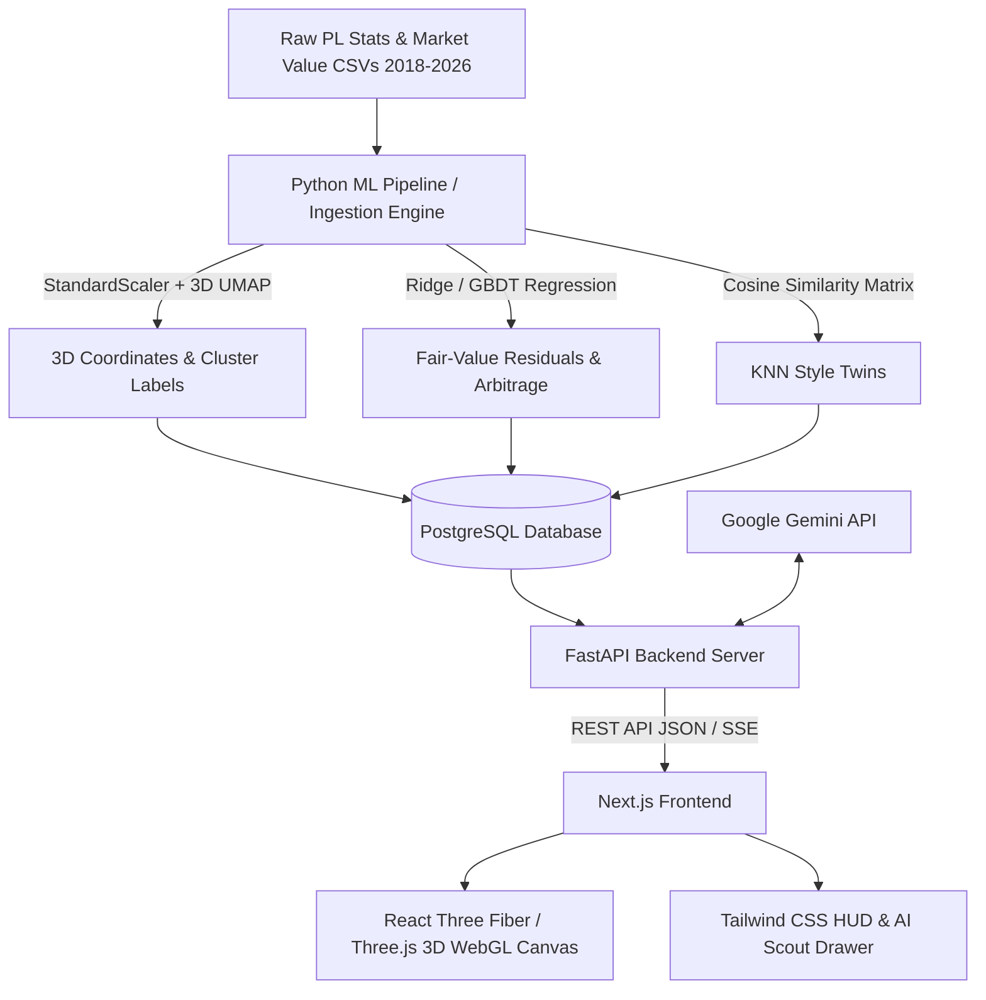

# Design Document: The Style Galaxy

**Project:** The Style Galaxy — Premier League Player Style Map & AI Scout  
**Date:** 2026-09-01  
**Status:** Approved  

---

## 1. Overview & Vision
"The Style Galaxy" is an interactive, spatial visualization of every playing style in the Premier League (2018–2026). Instead of a traditional spreadsheet or chat-first interface, tactical intelligence is represented as an astrophysical 3D constellation:
* **Geometry = Playing Style:** Players with similar per-90 tactical profiles cluster together via UMAP dimensionality reduction.
* **Size = Market Value:** Dot sizes reflect current Transfermarkt valuations.
* **Glow = Moneyball Arbitrage:** A machine-learning Fair-Value regression predicts market value from statistical output. The residual ($\text{Predicted} - \text{Actual}$) illuminates undervalued gems with a pulsing neon aura.
* **Grounded AI Scout:** Selecting any player or region opens an AI scout dossier powered by Gemini, grounded directly in the player's exact metric percentiles, high-dimensional cosine similarity neighbors, and valuation gap.
* **Career Trajectory Animation:** Users can toggle career trajectory trails, visualizing how young prospects and seasoned veterans drifted across tactical space and market values across seasons.

---

## 2. Architecture & Tech Stack



### Stack Components
* **Database:** Local PostgreSQL (strict `snake_case` naming conventions).
* **ML & Data Pipeline:** Python 3.11+ (`pandas`, `numpy`, `scikit-learn`, `umap-learn`, `scipy`).
* **Backend:** FastAPI, `psycopg2` / `asyncpg` / `SQLAlchemy`, Google GenAI SDK (`google-genai` / `google-generativeai`).
* **Frontend:** Next.js 14+ (App Router), React 18/19, Tailwind CSS, `@react-three/fiber`, `@react-three/drei`, `three`, `lucide-react`, `recharts` / SVG radar charts.

---

## 3. Database Schema (PostgreSQL, Strict `snake_case`)

```sql
-- 1. Base Players Table
CREATE TABLE IF NOT EXISTS players (
    player_id VARCHAR(64) PRIMARY KEY,
    name VARCHAR(255) NOT NULL,
    team VARCHAR(255) NOT NULL,
    position VARCHAR(64) NOT NULL,
    current_market_value_eur BIGINT DEFAULT 0,
    created_at TIMESTAMP WITH TIME ZONE DEFAULT CURRENT_TIMESTAMP
);

-- 2. Seasonal Performance Statistics (Per-90 Normalized)
CREATE TABLE IF NOT EXISTS player_season_stats (
    id SERIAL PRIMARY KEY,
    player_id VARCHAR(64) REFERENCES players(player_id) ON DELETE CASCADE,
    season VARCHAR(16) NOT NULL,
    appearances INT DEFAULT 0,
    minutes_played INT DEFAULT 0,
    goals_per_90 NUMERIC(6,3) DEFAULT 0,
    assists_per_90 NUMERIC(6,3) DEFAULT 0,
    xg_per_90 NUMERIC(6,3) DEFAULT 0,
    xa_per_90 NUMERIC(6,3) DEFAULT 0,
    shots_per_90 NUMERIC(6,3) DEFAULT 0,
    shots_on_target_pct NUMERIC(5,2) DEFAULT 0,
    key_passes_per_90 NUMERIC(6,3) DEFAULT 0,
    through_balls_per_90 NUMERIC(6,3) DEFAULT 0,
    successful_dribbles_per_90 NUMERIC(6,3) DEFAULT 0,
    forward_passes_per_90 NUMERIC(6,3) DEFAULT 0,
    pass_completion_pct NUMERIC(5,2) DEFAULT 0,
    touches_in_box_per_90 NUMERIC(6,3) DEFAULT 0,
    tackles_won_per_90 NUMERIC(6,3) DEFAULT 0,
    interceptions_per_90 NUMERIC(6,3) DEFAULT 0,
    recoveries_per_90 NUMERIC(6,3) DEFAULT 0,
    aerial_duels_won_pct NUMERIC(5,2) DEFAULT 0,
    losses_of_possession_per_90 NUMERIC(6,3) DEFAULT 0,
    UNIQUE (player_id, season)
);

-- 3. Market Value Timeline
CREATE TABLE IF NOT EXISTS market_value_history (
    id SERIAL PRIMARY KEY,
    player_id VARCHAR(64) REFERENCES players(player_id) ON DELETE CASCADE,
    valuation_date DATE NOT NULL,
    market_value_eur BIGINT NOT NULL,
    club VARCHAR(255) NOT NULL
);

-- 4. Galaxy Graph & Coordinate Projections
CREATE TABLE IF NOT EXISTS galaxy_nodes (
    player_id VARCHAR(64) PRIMARY KEY REFERENCES players(player_id) ON DELETE CASCADE,
    coord_x NUMERIC(8,4) NOT NULL,
    coord_y NUMERIC(8,4) NOT NULL,
    coord_z NUMERIC(8,4) NOT NULL,
    cluster_id INT NOT NULL,
    cluster_label VARCHAR(128) NOT NULL,
    actual_market_value_eur BIGINT NOT NULL,
    predicted_market_value_eur BIGINT NOT NULL,
    value_residual_eur BIGINT NOT NULL,
    value_efficiency_score NUMERIC(5,2) NOT NULL, -- normalized 0-100
    is_undervalued_gem BOOLEAN DEFAULT FALSE,
    nearest_neighbors JSONB NOT NULL DEFAULT '[]'::jsonb, -- Top 5 similar players
    radar_percentiles JSONB NOT NULL DEFAULT '{}'::jsonb -- Shooting, Creation, Progression, Defense, Retention
);

-- 5. Historical Career Trajectories for Trajectory Animation Mode
CREATE TABLE IF NOT EXISTS player_career_trajectories (
    id SERIAL PRIMARY KEY,
    player_id VARCHAR(64) REFERENCES players(player_id) ON DELETE CASCADE,
    season VARCHAR(16) NOT NULL,
    season_order INT NOT NULL,
    coord_x NUMERIC(8,4) NOT NULL,
    coord_y NUMERIC(8,4) NOT NULL,
    coord_z NUMERIC(8,4) NOT NULL,
    market_value_eur BIGINT NOT NULL,
    minutes_played INT NOT NULL,
    xg_per_90 NUMERIC(6,3) DEFAULT 0,
    xa_per_90 NUMERIC(6,3) DEFAULT 0
);
```

---

## 4. ML Pipeline & Mathematical Grounding

### A. Feature Extraction & Per-90 Normalization
1. Reads all season files `data/players_*.csv`, `data/players_career_xg.csv`, and `data/transfermarkt_market_values.csv`.
2. Computes per-90 metrics:
   $$\text{metric\_per\_90} = \frac{\text{raw\_count} \times 90}{\text{time\_played}}$$
3. Filters for minimum sample size ($>450$ minutes played) to eliminate noise from small sample sizes.
4. Aggregates multi-season career statistics weighted by minutes played for the primary galaxy coordinate space.

### B. UMAP 3D Manifold Learning
* **Inputs:** 18 normalized statistical features spanning Finishing, Playmaking, Progression, Defending, and Retention.
* **Transform:** `StandardScaler` $\rightarrow$ `umap.UMAP(n_components=3, n_neighbors=15, min_dist=0.15, metric='cosine', random_state=42)`.
* **K-Means / HDBSCAN Tactical Clusters:** Generates 8 distinct style clusters:
  1. *Isolated Penalty-Box Finishers* (e.g. Haaland, Wood)
  2. *Elite Inverted Creators & Wingers* (e.g. Salah, Saka, Son)
  3. *Deep-Lying Tempo Playmakers* (e.g. Rodri, Rice)
  4. *High-Energy Box-to-Box Engines* (e.g. Bruno Guimarães, Szoboszlai)
  5. *Ball-Carrying Attacking Midfielders* (e.g. Palmer, De Bruyne, Foden)
  6. *Aggressive Ball-Playing Center-Backs* (e.g. Saliba, Van Dijk, Gabriel)
  7. *Overlapping / Inverted Full-Backs* (e.g. Alexander-Arnold, Pedro Porro, Gvardiol)
  8. *Commanding Goalkeepers / Sweeper-Keepers* (e.g. Raya, Alisson, Ederson)
* **Season Projections:** The trained UMAP reducer projects individual seasonal vectors into the same fixed coordinate space to produce chronological trajectory waypoints.

### C. Fair-Value Residual Regression (The Moneyball Layer)
* **Model:** Gradient Boosting Regressor (`HistGradientBoostingRegressor` / `RidgeCV`) trained on player performance metrics + age to predict $\log(\text{market\_value\_eur})$.
* **Predicted Market Value:** $\hat{V} = \exp(\hat{y})$.
* **Value Residual:**
  $$\Delta V = \hat{V} - V_{\text{actual}}$$
* **Arbitrage Rating:**
  * $\Delta V > +€15\text{M}$ $\rightarrow$ **Undervalued Gem** (Glowing aura, high value efficiency).
  * $-€15\text{M} \le \Delta V \le +€15\text{M}$ $\rightarrow$ **Fair Market Value**.
  * $\Delta V < -€15\text{M}$ $\rightarrow$ **Overvalued Premium**.

### D. High-Dimensional Cosine Similarity Matrix
* For every player, computes top 5 nearest neighbors in the 18-dimensional feature space using cosine similarity, capturing both statistical twin identity and price differential.

---

## 5. FastAPI Backend API Specification

### Endpoints
1. `GET /api/health`
   * Healthcheck & database connection status.
2. `GET /api/galaxy`
   * Response:
     ```json
     {
       "nodes": [
         {
           "player_id": "118748",
           "name": "Mohamed Salah",
           "team": "Liverpool",
           "position": "Forward",
           "coords": [12.42, -4.18, 7.85],
           "market_value_eur": 55000000,
           "predicted_value_eur": 68000000,
           "value_residual_eur": 13000000,
           "value_efficiency_score": 82.5,
           "is_undervalued_gem": false,
           "cluster_id": 2,
           "cluster_label": "Elite Inverted Creators & Wingers",
           "nearest_neighbors": [
             {"player_id": "223340", "name": "Bukayo Saka", "similarity": 0.94, "market_value_eur": 140000000}
           ],
           "radar": {
             "shooting": 96,
             "creation": 94,
             "progression": 88,
             "defense": 32,
             "retention": 84
           }
         }
       ],
       "clusters": [
         {"cluster_id": 2, "label": "Elite Inverted Creators & Wingers", "color": "#f59e0b", "count": 42}
       ]
     }
     ```
3. `GET /api/players/{player_id}`
   * Detailed player profile, historical seasons, market value history, and trajectory coordinates.
4. `GET /api/search?q={query}&position={pos}&undervalued_only={bool}`
   * Instant search filter for auto-complete and camera framing.
5. `POST /api/scout/analyze`
   * Body: `{"player_id": "118748"}`
   * Calls Google Gemini API with structured player metrics, nearest neighbors, and value residual to generate an executive scouting blurb.
6. `POST /api/scout/query`
   * Body: `{"query": "Find me a pressing winger under 30M similar to Saka", "target_player_id": "223340"}`
   * Performs spatial neighbor search + market value filtering, then passes structured candidate context to Gemini to narrate the tactical recommendation.

---

## 6. Frontend 3D Galaxy Interface (Next.js + React Three Fiber)

### Visual Experience & Shader Design
* **Space Environment:** Deep pitch black space (`#030712`) with procedural twinkling background starfield particles.
* **Galaxy Nodes (InstancedMesh / Points):**
  * **Colors:**
    * Forwards: Orange / Coral (`#f97316`)
    * Midfielders: Emerald / Mint (`#10b981`)
    * Defenders: Electric Blue / Cyan (`#06b6d4`)
    * Goalkeepers: Gold (`#eab308`)
  * **Size:** Scaled by $\log_{10}(\text{Market Value})$.
  * **Glow Halo:** Custom circular sprite / point shader with pulsing green aura for `is_undervalued_gem == true`.
  * **Hover / Selection Rings:** Interactive hover glow and 3D pointer ring around selected player.
* **Camera Fly-To:**
  * Animated camera repositioning smoothly framing the selected node with offset $[x+5, y+3, z+10]$ facing target $[x, y, z]$.
* **Career Trajectory Mode:**
  * Render smooth Catmull-Rom 3D splines with glowing gradient trails connecting historical seasonal positions from 2018-19 to 2025-26.

### UI Controls & HUD
1. **Top Header & Search:**
   * Global fuzzy search bar with keyboard shortcuts (`Cmd+K`).
   * Quick filter pills: All, FWD, MID, DEF, GK, "Undervalued Gems" switch, "Career Trajectories" switch.
2. **Right Side Scout Drawer:**
   * Player overview badge with photo silhouette, club, actual valuation vs Model Fair Value.
   * Radar chart visualizer comparing player against position average.
   * "Map Neighbors & Arbitrage Twins" list (Top 3 geometric twins with price gap).
   * AI Scout Briefing box streaming / presenting Gemini insights.
   * Interactive follow-up prompt input.

---

## 7. Testing & Verification Plan

1. **Pipeline Verification:**
   * Python unit tests verifying per-90 math, zero division safety, UMAP shape stability $(N, 3)$, and residual model accuracy ($R^2 > 0.65$ on log market value).
   * PostgreSQL table population script verification (confirm non-empty tables and foreign key integrity).
2. **Backend API Verification:**
   * `pytest` test suite testing `/api/galaxy`, `/api/players/{id}`, `/api/search`, and mocking `/api/scout/analyze` Gemini calls.
3. **Frontend E2E / Render Verification:**
   * Verify Next.js build compilation without type errors.
   * Verify WebGL 3D Canvas initialization and interaction (node click, hover tooltip, camera fly-to, trajectory toggles).
   * Verify AI scout drawer state and response rendering.
